  

<h1 align="center">
  Hi, I'm <b>Pizza Dev</b>
  
</h1>

 

&nbsp;&nbsp;&nbsp;🎓 <b>Software Engineer</b>  

&nbsp;&nbsp;&nbsp;💻 Developer of <b>websites, applications, and Roblox games.</b>

&nbsp;&nbsp;&nbsp;🚀 I enjoy turning ideas into <b>functional projects</b>, including user interfaces, 
&nbsp;&nbsp;&nbsp;backend systems, complete applications, and game mechanics. 

&nbsp;&nbsp;&nbsp;🎮 More than <b>4 years programming and developing projects</b> using different 
&nbsp;&nbsp;&nbsp;technologies, platforms, frameworks, and development environments.   

&nbsp;&nbsp;&nbsp;🛠️ Interested in <b>software development, backend infrastructure, game development, servers, databases, and UI/UX.</b>

### 📫 Contact me

**Discord:** `err_pizza`  
**X / Twitter:** `@err`

⚡ **Fun fact:** 🍕

   

 

  

 

##  Technologies I Know

### 💻 Languages

### 🛠️ Technologies & Tools

### 🗄️ Databases

### 🖥️ Platforms & Development Environments

---

<h2 align="center">📊 GitHub Stats</h2>

  
  

  

